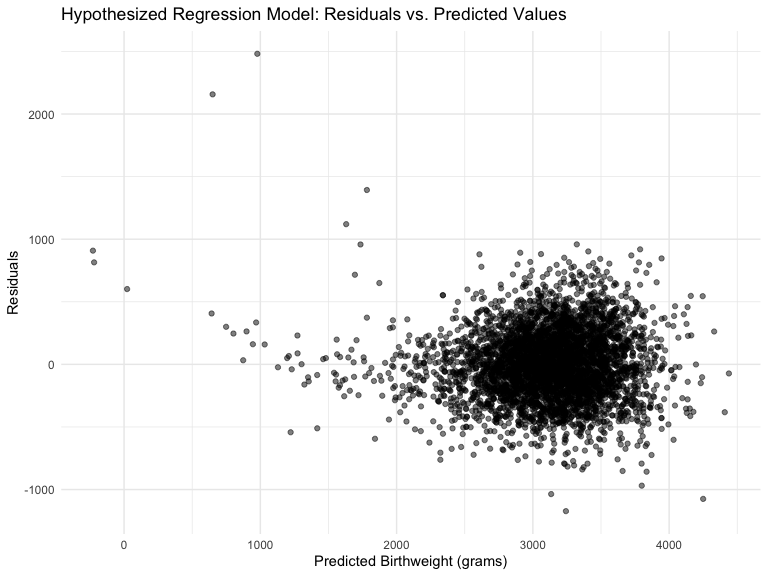
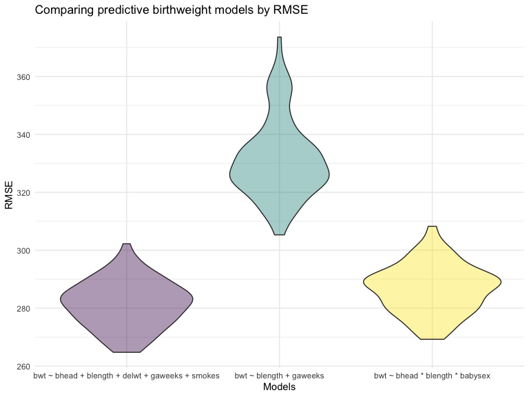
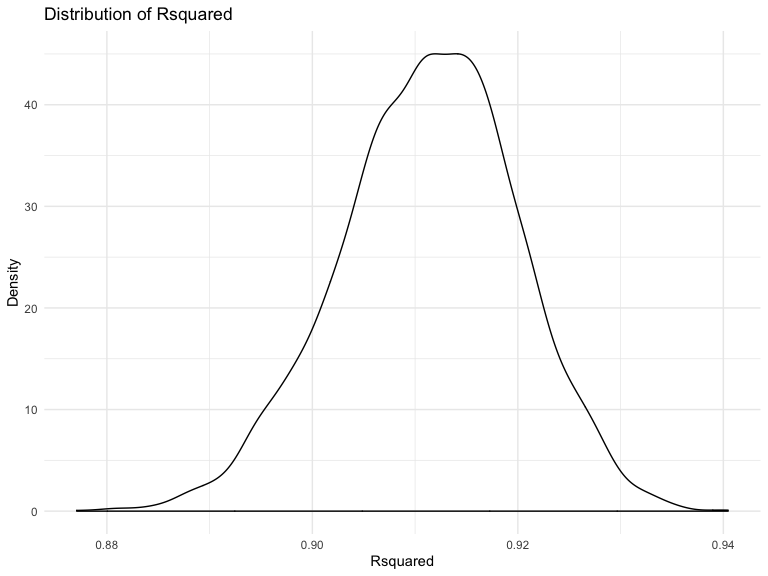
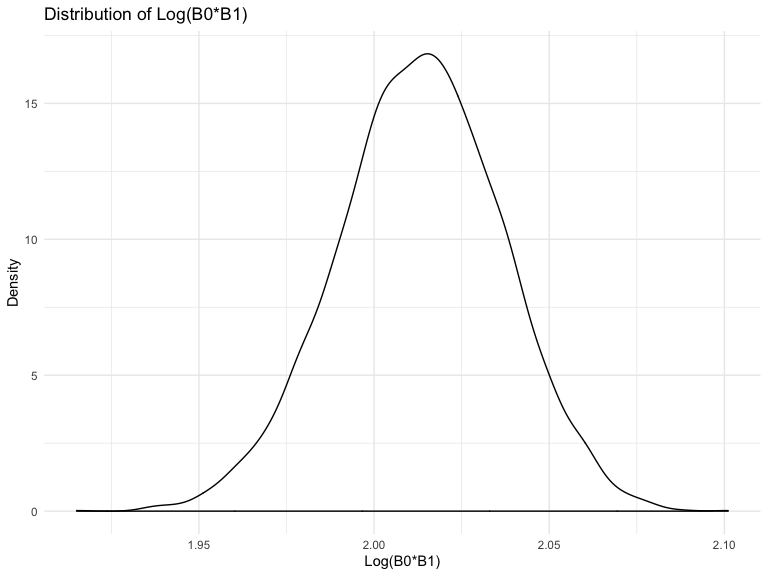

Homework 6 Linear Models
================
Keyanna Davis
11/25/2019

Problem 0
=========

This “problem” focuses on structure of your submission, especially the use git and GitHub for reproducibility, R Projects to organize your work, R Markdown to write reproducible reports, relative paths to load data from local files, and reasonable naming structures for your files. To that end:

-   create a public GitHub repo + local R Project; we suggest naming this repo / directory p8105\_hw6\_YOURUNI (e.g. p8105\_hw6\_ajg2202 for Jeff), but that’s not required
-   create a single .Rmd file named p8105\_hw6\_YOURUNI.Rmd that renders to github\_document
-   create a subdirectory to store the local data files used in the assignment, and use relative paths to access these data files submit a link to your repo via Courseworks

Your solutions to Problems 1 and 2 should be implemented in your .Rmd file, and your git commit history should reflect the process you used to solve these Problems.

For this Problem, we will assess adherence to the instructions above regarding repo structure, git commit history, and whether we are able to knit your .Rmd to ensure that your work is reproducible. Adherence to appropriate styling and clarity of code will be assessed in Problems 1+ using the style rubric.

This homework includes figures; the readability of your embedded plots (e.g. font sizes, axis labels, titles) will be assessed in Problems 1+.

Problem 1
=========

In this problem, you will analyze data gathered to understand the effects of several variables on a child’s birthweight. This dataset, available here, consists of roughly 4000 children and includes the following variables:

-   babysex: baby’s sex (male = 1, female = 2)
-   bhead: baby’s head circumference at birth (centimeters)
-   blength: baby’s length at birth (centimeteres)
-   bwt: baby’s birth weight (grams)
-   delwt: mother’s weight at delivery (pounds)
-   fincome: family monthly income (in hundreds, rounded)
-   frace: father’s race (1 = White, 2 = Black, 3 = Asian, 4 = Puerto Rican, 8 = Other, 9 = Unknown)
-   gaweeks: gestational age in weeks
-   malform: presence of malformations that could affect weight (0 = absent, 1 = present)
-   menarche: mother’s age at menarche (years)
-   mheigth: mother’s height (inches)
-   momage: mother’s age at delivery (years)
-   mrace: mother’s race (1 = White, 2 = Black, 3 = Asian, 4 = Puerto Rican, 8 = Other)
-   parity: number of live births prior to this pregnancy
-   pnumlbw: previous number of low birth weight babies
-   pnumgsa: number of prior small for gestational age babies
-   ppbmi: mother’s pre-pregnancy BMI
-   ppwt: mother’s pre-pregnancy weight (pounds)
-   smoken: average number of cigarettes smoked per day during pregnancy
-   wtgain: mother’s weight gain during pregnancy (pounds)

Load and clean the data for regression analysis (i.e. convert numeric to factor where appropriate, check for missing data, etc.).

``` r
birthweight = read.csv("./data/birthweight.csv") %>%
  janitor::clean_names() %>%
  mutate(
    babysex = as.factor(babysex),
    frace = as.factor(frace),
    malform = as.factor(malform),
    mrace = as.factor(mrace)
  ) 
#birthweight %>% 
  #skimr::skim()
birthweight = 
  birthweight %>% 
  select(-pnumlbw, -pnumsga)
```

The `birthweight` dataset has 4342 and 18 after I removed two of the columns `previous number of low birthweight babies(pnumlbw)` and `number of of prior small for gestational age babies(pnumsga)`. I removed these two variables because when I looked through the dataset I notice that all valvues for these columns were `0` so I felt there wasn't a point in having these variables in the dataset.

### Problem 1.1

Propose a regression model for birthweight. This model may be based on a hypothesized structure for the factors that underly birthweight, on a data-driven model-building process, or a combination of the two. Describe your modeling process and show a plot of model residuals against fitted values – use add\_predictions and add\_residuals in making this plot.

Note that although we expect your model to be reasonable, model building itself is not a main idea of the course and we don’t necessarily expect your model to be “optimal”.

``` r
birthwt =
birthweight %>% 
  mutate(
    smokes =  if_else(smoken > 0, '1', '0'),
    smokes = as.factor(smokes)
  ) 
 bwt_model = lm(bwt ~ bhead + blength + delwt + gaweeks + malform + smokes, data = birthwt)
 summary(bwt_model)
```

    ## 
    ## Call:
    ## lm(formula = bwt ~ bhead + blength + delwt + gaweeks + malform + 
    ##     smokes, data = birthwt)
    ## 
    ## Residuals:
    ##      Min       1Q   Median       3Q      Max 
    ## -1172.44  -187.32    -8.29   177.66  2481.75 
    ## 
    ## Coefficients:
    ##               Estimate Std. Error t value Pr(>|t|)    
    ## (Intercept) -6197.3464    95.8535 -64.654  < 2e-16 ***
    ## bhead         134.9332     3.4999  38.553  < 2e-16 ***
    ## blength        78.6042     2.0732  37.914  < 2e-16 ***
    ## delwt           2.0996     0.1995  10.524  < 2e-16 ***
    ## gaweeks        14.4887     1.4899   9.725  < 2e-16 ***
    ## malform1       32.5884    73.0023   0.446    0.655    
    ## smokes1       -39.9297     8.7703  -4.553 5.44e-06 ***
    ## ---
    ## Signif. codes:  0 '***' 0.001 '**' 0.01 '*' 0.05 '.' 0.1 ' ' 1
    ## 
    ## Residual standard error: 282.2 on 4335 degrees of freedom
    ## Multiple R-squared:  0.6969, Adjusted R-squared:  0.6965 
    ## F-statistic:  1661 on 6 and 4335 DF,  p-value: < 2.2e-16

``` r
 bwt_model1 = lm(bwt ~ bhead + blength + delwt + gaweeks + smokes, data = birthwt)
 summary(bwt_model1)
```

    ## 
    ## Call:
    ## lm(formula = bwt ~ bhead + blength + delwt + gaweeks + smokes, 
    ##     data = birthwt)
    ## 
    ## Residuals:
    ##      Min       1Q   Median       3Q      Max 
    ## -1172.56  -187.28    -8.39   177.91  2481.24 
    ## 
    ## Coefficients:
    ##               Estimate Std. Error t value Pr(>|t|)    
    ## (Intercept) -6197.2418    95.8444 -64.659  < 2e-16 ***
    ## bhead         134.9509     3.4994  38.565  < 2e-16 ***
    ## blength        78.5914     2.0728  37.915  < 2e-16 ***
    ## delwt           2.1007     0.1995  10.532  < 2e-16 ***
    ## gaweeks        14.4851     1.4897   9.723  < 2e-16 ***
    ## smokes1       -39.8767     8.7687  -4.548 5.57e-06 ***
    ## ---
    ## Signif. codes:  0 '***' 0.001 '**' 0.01 '*' 0.05 '.' 0.1 ' ' 1
    ## 
    ## Residual standard error: 282.1 on 4336 degrees of freedom
    ## Multiple R-squared:  0.6969, Adjusted R-squared:  0.6965 
    ## F-statistic:  1994 on 5 and 4336 DF,  p-value: < 2.2e-16

``` r
 birthwt %>% 
  add_predictions(bwt_model1) %>% 
  add_residuals (bwt_model1) %>% 
  ggplot(aes(x = pred, y = resid)) + 
    geom_point(alpha = 0.5) +
   #ylim(-1000,1000) +
  labs(
        title = "Hypothesized Regression Model: Residuals vs. Predicted Values",
        x = "Predicted Birthweight (grams)",
        y = "Residuals"
      )
```



I hypothesized my model based off what I thought would be the best predictors of birthweight. I first fitted a model with `baby head circumference at birth`, `baby's length at birth`, `mother's weight at delivery`, `gastational age in weeks`, `presence of malformations that could affect weight` and `whether or not the women smoked during the pregnancy`. I chose to make `smoken` a binary variable because I felt that if a mother smoked during the pregnancy that it will affect the birthweight regardless rather than how much she smoked. After looking at the summmary of my fitted model `bwt_model` I noticed that the `presence of malformations` was not significant when compared to those babies without the presence of malformations when it comes to birthweight. So for my second model I fitted `bwt_model1` I removed `presence of malformations` and just kept all the other predictors.

After graphing the residuals vs predictors I notice a cluster of values on the right side of the graph and I see a few outliers on the left side at the top of the graph. So maybe this is not the best fitted model.

### Problem 1.2

Compare your model to two others:

-   One using length at birth and gestational age as predictors (main effects only)
-   One using head circumference, length, sex, and all interactions (including the three-way interaction) between these

``` r
bwt_model2 = lm(bwt ~ blength + gaweeks, data = birthwt)
summary(bwt_model2)
```

    ## 
    ## Call:
    ## lm(formula = bwt ~ blength + gaweeks, data = birthwt)
    ## 
    ## Residuals:
    ##     Min      1Q  Median      3Q     Max 
    ## -1709.6  -215.4   -11.4   208.2  4188.8 
    ## 
    ## Coefficients:
    ##              Estimate Std. Error t value Pr(>|t|)    
    ## (Intercept) -4347.667     97.958  -44.38   <2e-16 ***
    ## blength       128.556      1.990   64.60   <2e-16 ***
    ## gaweeks        27.047      1.718   15.74   <2e-16 ***
    ## ---
    ## Signif. codes:  0 '***' 0.001 '**' 0.01 '*' 0.05 '.' 0.1 ' ' 1
    ## 
    ## Residual standard error: 333.2 on 4339 degrees of freedom
    ## Multiple R-squared:  0.5769, Adjusted R-squared:  0.5767 
    ## F-statistic:  2958 on 2 and 4339 DF,  p-value: < 2.2e-16

``` r
bwt_model3 = lm(bwt ~ bhead * blength * babysex, data = birthwt)
summary(bwt_model3)
```

    ## 
    ## Call:
    ## lm(formula = bwt ~ bhead * blength * babysex, data = birthwt)
    ## 
    ## Residuals:
    ##      Min       1Q   Median       3Q      Max 
    ## -1132.99  -190.42   -10.33   178.63  2617.96 
    ## 
    ## Coefficients:
    ##                          Estimate Std. Error t value Pr(>|t|)    
    ## (Intercept)            -7176.8170  1264.8397  -5.674 1.49e-08 ***
    ## bhead                    181.7956    38.0542   4.777 1.84e-06 ***
    ## blength                  102.1269    26.2118   3.896 9.92e-05 ***
    ## babysex2                6374.8684  1677.7669   3.800 0.000147 ***
    ## bhead:blength             -0.5536     0.7802  -0.710 0.478012    
    ## bhead:babysex2          -198.3932    51.0917  -3.883 0.000105 ***
    ## blength:babysex2        -123.7729    35.1185  -3.524 0.000429 ***
    ## bhead:blength:babysex2     3.8781     1.0566   3.670 0.000245 ***
    ## ---
    ## Signif. codes:  0 '***' 0.001 '**' 0.01 '*' 0.05 '.' 0.1 ' ' 1
    ## 
    ## Residual standard error: 287.7 on 4334 degrees of freedom
    ## Multiple R-squared:  0.6849, Adjusted R-squared:  0.6844 
    ## F-statistic:  1346 on 7 and 4334 DF,  p-value: < 2.2e-16

### Problem 1.3

Make this comparison in terms of the cross-validated prediction error; use crossv\_mc and functions in purrr as appropriate.

``` r
cv_birthwt =
 crossv_mc(birthwt, 100)
```

``` r
cv_birthwt = 
  cv_birthwt %>% 
  mutate(bwt_model1 = map(train, ~bwt_model1),
         bwt_model2 = map(train, ~bwt_model2),
         bwt_model3= map(train, ~bwt_model3)) %>% 
  mutate(rmse_bwt_model1 = map2_dbl(bwt_model1, test, ~rmse(model = .x, data = .y)),
         rmse_bwt_model2 = map2_dbl(bwt_model2, test, ~rmse(model = .x, data = .y)),
         rmse_bwt_model3 = map2_dbl(bwt_model3, test, ~rmse(model = .x, data = .y)))
```

``` r
cv_birthwt %>% 
  select(starts_with("rmse")) %>% 
  pivot_longer(
    everything(),
    names_to = "model",
    values_to = "rmse",
    names_prefix = "rmse"
  ) %>%
  mutate(model = str_sub(model, 2)) %>% 
  mutate(model = 
           recode(model, 
           bwt_model1 = "bwt ~ bhead + blength + delwt + gaweeks + smokes", 
           bwt_model2 = "bwt ~ blength + gaweeks",
          bwt_model3 = "bwt ~ bhead * blength * babysex"), 
         model = fct_inorder(model)) %>% 
  ggplot(aes(x = model, y = rmse, fill = model)) + 
  geom_violin(alpha = .4) +
  theme(legend.position = "none") +
  labs(
        title = "Comparing predictive birthweight models by RMSE",
        x = "Models",
        y = "RMSE"
      ) 
```



When comparing the three models, the first model is the model I would choose because it has the smallest RMSE. The second model has the largest RMSEs and the third model has a small RMSE as well but not as small as the first model. The interaction model will be much harder to interpret, so first model is a better choice to use.

Problem 2
=========

For this problem, we’ll use the 2017 Central Park weather data that we’ve seen elsewhere. The code chunk below (adapted from the course website) will download these data.

``` r
weather_df = 
  rnoaa::meteo_pull_monitors(
    c("USW00094728"),
    var = c("PRCP", "TMIN", "TMAX"), 
    date_min = "2017-01-01",
    date_max = "2017-12-31") %>%
  mutate(
    name = recode(id, USW00094728 = "CentralPark_NY"),
    tmin = tmin / 10,
    tmax = tmax / 10) %>%
  select(name, id, everything())
```

    ## Registered S3 method overwritten by 'crul':
    ##   method                 from
    ##   as.character.form_file httr

    ## Registered S3 method overwritten by 'hoardr':
    ##   method           from
    ##   print.cache_info httr

    ## file path:          /Users/keyannadavis/Library/Caches/rnoaa/ghcnd/USW00094728.dly

    ## file last updated:  2019-09-26 10:31:53

    ## file min/max dates: 1869-01-01 / 2019-09-30

The bootstrap is helpful when you’d like to perform inference for a parameter / value / summary that doesn’t have an easy-to-write-down distribution in the usual repeated sampling framework. We’ll focus on a simple linear regression with tmax as the response and tmin as the predictor, and are interested in the distribution of two quantities estimated from these data:

-   r̂2
-   log(β̂0∗β̂1)

Use 5000 bootstrap samples and, for each bootstrap sample, produce estimates of these two quantities. Plot the distribution of your estimates, and describe these in words. Using the 5000 bootstrap estimates, identify the 2.5% and 97.5% quantiles to provide a 95% confidence interval for r̂2 and log(β̂0∗β̂1) . Note: broom::glance() is helpful for extracting r̂2 from a fitted regression, and broom::tidy() (with some additional wrangling) should help in computing log(β̂0∗β̂1)

### Problem 2.1

-   Bootstrap and Distribution of r̂2

``` r
boot_straps = 
weather_df %>% 
  bootstrap(n = 5000) %>% 
  mutate(
   models = map(strap, ~lm(tmax ~ tmin, data = .x)),
    results = map(models, broom::glance)) %>% 
    select(-strap, -models) %>% 
  unnest(results) %>% 
  janitor::clean_names() 

boot_straps %>% 
  ggplot(aes(x = r_squared)) +
  geom_density() +
   labs(
    title = "Distribution of Rsquared",
    x = "Rsquared",
    y = "Density"
  ) 
```



The plot shows the dstribution is negatively skewed, which may just indicate that there may be some outliers present.

### Problem 2.2

-   Bootstrap and Distribution of log(β̂0∗β̂1)

``` r
boot_straps2 =
weather_df %>% 
  bootstrap(n = 5000)  %>% 
  mutate(
    models = map(strap, ~lm(tmax ~ tmin, data = .x)),
    results = map(models, broom::tidy)) %>% 
   select(-strap, -models) %>% 
  unnest(results) %>% 
  janitor::clean_names() %>% 
    select(id, term, estimate) %>% 
  pivot_wider(
    names_from = term,
    values_from = estimate
  ) %>% 
  janitor::clean_names() %>% 
  mutate(
   log = log(intercept * tmin)
  )
  boot_straps2 %>% 
  ggplot(aes(x = log)) +
  geom_density() +
  labs(
    title = "Distribution of Log(B0*B1)",
    x = "Log(B0*B1)", 
    y = "Density"
  )
```



The graph shows close to a symmetrical distribution but the tail on the left side is a little longer than on the right side, so it may be a few outliers but not many.

### Problem 2.3

Using the 5000 bootstrap estimates, identify the 2.5% and 97.5% quantiles to provide a 95% confidence interval for r̂2 and log(β̂0∗β̂1)

``` r
CI_lower = quantile(pull(boot_straps, r_squared), probs = .025)
CI_upper = quantile(pull(boot_straps, r_squared), probs = .975)

CI_lower2 = quantile(pull(boot_straps2, log), probs = .025)
CI_upper2 = quantile(pull(boot_straps2, log), probs = .975)
```

The 95% confidence interval for `r_squared` is (0.8936977, 0.9274807).

The 95% confidence interval for `log(b0*b1)` is (1.9656328, 2.0584694).
